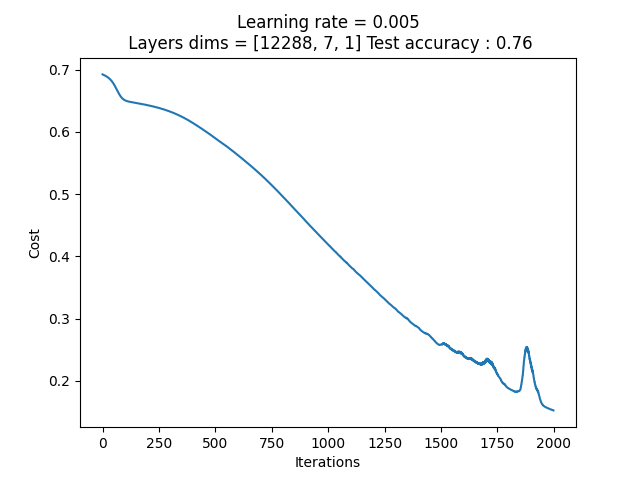
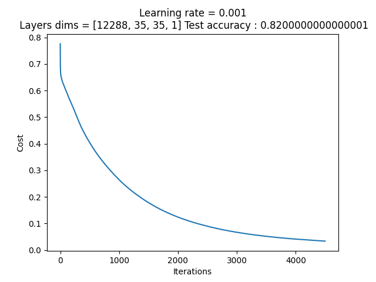

# Scratch-neural-networks

This repository contains only neural networks made exclusively with np and h5py

## Logistic regression model 

It's a simple model which only has 1 neuron

### Hyper parameters

Learning rate 
- 0.005

Number of iterations 
- 2000

Activation function
- Sigmoid

### Results

- Train accuracy: 99.04306220095694 %
- Test accuracy: 70.0 %

### Remarks
This model is clearly over-fitting

## 2 Layers Neural Network

It's a 2 layers neural network with 7 hidden units

### Hyper parameters

Learning rate 
- 0.005

Number of iterations 
- 2000

Activation functions
- Relu
- Sigmoid

### Results

- Train accuracy: 96.17224880382773 %
- Test accuracy: 74.0 %
- Graph

### Remarks
This model is clearly over-fitting and seems to be pretty inconsistent

## 3 Layers Neural Network

It's a 3 layers neural network with twice 35 hidden units

### Hyper parameters

Learning rate 
- 0.001

Number of iterations 
- 4500

Activation functions
- Relu
- Sigmoid

### Results

- Train accuracy : 99.999999999999 %
- Test accuracy: 82.0 %
- Graph

### Remarks
This model is clearly over-fitting

The number of layers and their dimensions can be changed easily with the layers_dims array
